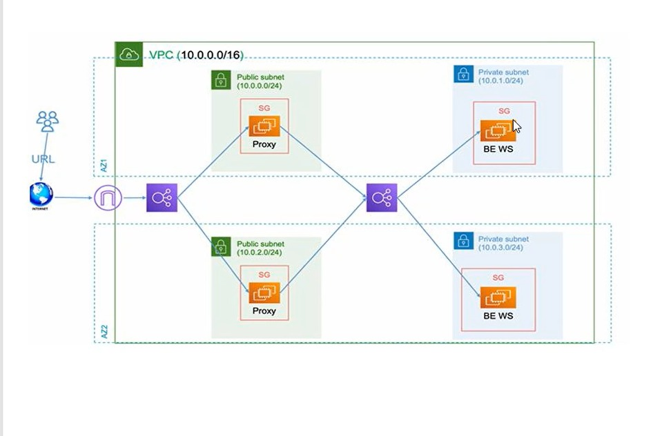

# Highly-Available Web Application on AWS with Terraform

This project uses Terraform to deploy a highly-available, fault-tolerant, and scalable web application infrastructure on Amazon Web Services (AWS). The architecture is designed to ensure the application remains online and responsive even if one availability zone goes down.

---

## Architecture

The infrastructure consists of the following components, deployed across two Availability Zones for high availability:

* **VPC:** A custom Virtual Private Cloud to provide a secure and isolated network environment.
* **Subnets:**
    * 2 Public Subnets for internet-facing resources like the load balancer and proxy servers.
    * 2 Private Subnets for backend application servers to protect them from direct internet access.
* **Gateways:**
    * An Internet Gateway (IGW) to allow internet access to the public subnets.
    * A NAT Gateway to allow instances in the private subnets to initiate outbound connections (e.g., for software updates).
* **Load Balancers:**
    * A public Application Load Balancer (ALB) that serves as the single entry point for all user traffic.
    * An internal Application Load Balancer that distributes traffic from the proxies to the backend application servers.
* **EC2 Instances:**
    * **Proxy Tier:** Nginx reverse proxies in the public subnets.
    * **Application Tier:** Apache web servers in the private subnets.
* **Security:**
    * Security Groups configured to act as virtual firewalls, strictly controlling traffic between tiers.
    * Network ACLs providing a stateless layer of security at the subnet level.
* **State Management:**
    * Terraform's state is stored remotely and securely in an S3 bucket with state locking via DynamoDB.



---

## Prerequisites

Before you begin, ensure you have the following:
* An AWS Account with appropriate permissions.
* Terraform installed on your local machine.
* AWS CLI installed and configured with your credentials.
* An SSH key pair generated (e.g., `~/.ssh/id_rsa`).

---

## How to Deploy

1.  **Clone the Repository:**
    ```
    git clone https://github.com/BasilMohamed03/aws-ha-webapp-terraform.git
    cd aws-ha-webapp-terraform
    ```
2.  **Configure the S3 Backend:**
    * You must manually create a globally unique S3 bucket and a DynamoDB table (`terraform-state-lock`) for state locking.
    * Open the `backend.tf` file and update the `bucket` name to the one you created.
3.  **Initialize Terraform:**
    ```
    terraform init
    ```
4.  **Create and Select a Workspace:**
    ```
    terraform workspace new dev
    ```
5.  **Plan and Apply:**
    ```
    terraform plan -out=dev.tfplan
    terraform apply "dev.tfplan"
    ```
    Terraform will provision all the resources. Type `yes` to confirm.

---

## Accessing the Application

Once the `apply` is complete, Terraform will output the public DNS name of the Application Load Balancer.
